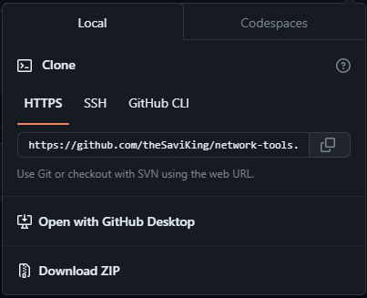

# network-tools <!-- omit from toc -->
***A tiny suite of tools for the PHS Network Team***

- [Requirements](#requirements)
- [Getting started](#getting-started)
  - [Checking Python installation](#checking-python-installation)
  - [Installing `network-tools`](#installing-network-tools)
  - [Installing required packages](#installing-required-packages)
- [About this module](#about-this-module)
  - [Available functionality](#available-functionality)
- [Using `network-tools`](#using-network-tools)
  - [Provisioning access points](#provisioning-access-points)
  - [Checking for config gaps](#checking-for-config-gaps)
  - [Experimenting with Python](#experimenting-with-python)
  - [Generating SN/MAC spreadsheet template](#generating-snmac-spreadsheet-template)
  - [Merging spreadsheets](#merging-spreadsheets)


## Requirements
A valid Python installation (options: Microsoft Store, [Python website](https://www.python.org/downloads/))

## Getting started

### Checking Python installation
To begin using network-tools, make sure you install Python and have it working on your system. To test that Python is working, open a Terminal window and run the `python` command:
```
PS C:\Users\...> python
```
The output should look something like this:
```
Python 3.11.3 (tags/v3.11.3:f3909b8, Apr  4 2023, 23:49:59) [MSC v.1934 64 bit (AMD64)] on win32
Type "help", "copyright", "credits" or "license" for more information.
>>>
```
If you get an error and you know Python was installed on your machine, try restarting your computer.

### Installing `network-tools`
To install the network-tools package, follow these steps:
- [x] Navigate to the network-tools repository. (Congrats! You made it!)
- [ ] Open the dropdown from the  button.
- [ ] In the dropdown menu, click "**Download ZIP**"<br>
- [ ] Extract the new ZIP file to a location. Remember it.

### Installing required packages
There are specific Python packages that are required in order for network-tools to run correctly. You can easily install all the required packages at once.

Simply open a terminal inside the network-tools folder that you just downloaded. Then, run this command:
```
pip install -r requirements.txt
```
All the necessary packages for network-tools should be installed on your machine.

## About this module

The network-tools module consists of a main program called "**main.py**" and other helper modules, stored in the `network` folder. Here's what your downloaded folder structure should look like:
```
network-tools-main/
├── README.md
├── main.py
├── requirements.txt
├── network/
│   ├── __init__.py
│   ├── __utils__.py
│   ├── devices.py
│   ├── provision.py
│   ├── range_string.py
│   ├── runconfig.py
│   ├── spreadsheet.py
│   └── site_config.py
└── pics/
    └── (images for README.md file)
```

### Available functionality
Currently, all the *checked* functions are available with ***network-tools***:
- [x] Provisioning access points
- [x] Checking for gaps in config files
- [x] Experimenting with a Python object holding a config file
- [x] Generating AP SN/MAC spreadsheet template
- [x] Merge fragmented SN/MAC spreadsheets

---

## Using `network-tools`

*****Before using any of the functions:***
1. Open a terminal in the `network-tools-main` folder.
2. Run `python main.py`

Open each dropdown to get information on that specific function.

<details open>
<summary>

### Provisioning access points
</summary>
To provision access points, you will need:

- A valid config file
    - The path to the file
- A microUSB cable
- A Power-over-Ethernet cable

When you run `main.py`, choose option 1 and follow the prompts.
</details>

<details>
<summary>

### Checking for config gaps
</summary>

To check for gaps in a config file, all you need is the path to the file to be checked.

Run `main.py`, choose option 2, and follow the prompts.
</details>

<details>
<summary>

### Experimenting with Python
</summary>

When you provision access points using `network-tools`, a [`SiteConfiguration`](https://github.com/theSaviKing/network-tools/blob/d2b626c3c166832a68875db1b763d1f75f89babf/network/site_config.py#L21-L108) object is created. During creation, the specified config file gets parsed and every block of config commands is broken down, split up into a list, and then added to a bigger list with all of the other config blocks. From there, the bigger list is looped during execution and each individual command is fed to the terminal on the access point by way of serial connection.

To experiment with a `SiteConfiguration` object and its methods, choose option 3, and follow the prompts to access an interactive Python terminal with a pre-loaded object.
</details>

<details>
<summary>

### Generating SN/MAC spreadsheet template
</summary>

To generate a spreadsheet template for scanning in serial numbers and MAC addresses for wireless access points, you just need a config file. Run `main.py`, choose option 4, and then enter the name of the config file and the filename you want the newly generated Excel file to be saved to (without the `.xlsx` extension on the end which is automatically added).
</details>

<details>
<summary>

### Merging spreadsheets
</summary>

If you have multiple fragmented SN/MAC spreadsheets, you can input the filename of each fragment of the spreadsheet. From there, this function will combine and order them by the "AP Name" column. Run `main.py`, choose option 5, and enter the fragment filenames.
</details>
